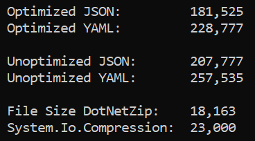

# Size Matters - JSON vs. YAML and System.IO.Compression vs. DotNetZip

This post contains information about reducing the size of serialized object graphs.  
It compares using JSON and YAML output formats.
- [Newtonsoft Json.NET](https://www.newtonsoft.com/json)
- [YamlDotNet](https://github.com/aaubry/YamlDotNet)

This post also highlights the output file size difference between using classes in the System.IO.Compression namespace versus the DotNetZip NuGet package.
- [System.IO.Compression](https://docs.microsoft.com/en-us/dotnet/api/system.io.compression) 
- [DotNetZip](https://github.com/haf/DotNetZip.Semverd)

## Straight to the Point

Simplistic testing results indicate that there is a definite benefit to optimizing the output.  An example run produced the following results:



### Summary Observations

- 27% reduction in file size using DotNetZip instead of System.IO.Compression
- 25% reduction in file size using JSON over YAML
- 14% reduction in file size optimizing the serializers

### About the Test Project

This test originated from a problem I was trying to tackle in that I did not want null values, default values, 
nor empty collections to end up in my serialized output.  The classes being serialized had a high number of 
empty collections that were causing unnecessary clutter and adding nothing of value.

### Serializer Optimizations

__JSON:__
```c#
var serializerSettings = new JsonSerializerSettings()
{   
	Formatting = Formatting.None,
	ReferenceLoopHandling = ReferenceLoopHandling.Ignore,
	NullValueHandling = NullValueHandling.Ignore,
	ContractResolver = IgnoreEmptyEnumerableContractResolver.Instance,
};
```
  

__YAML:__
```c#
var serializer = new YamlDotNet.Serialization.SerializerBuilder()
	.WithNamingConvention(new YamlDotNet.Serialization.NamingConventions.CamelCaseNamingConvention())
	.WithEmissionPhaseObjectGraphVisitor(args => new YamlIEnumerableSkipEmptyObjectGraphVisitor(args.InnerVisitor, args.TypeConverters, args.NestedObjectSerializer))
	.Build();
```

.
  

#### Key JSON Serializer Code

```c#
public class IgnoreEmptyEnumerableContractResolver : CamelCasePropertyNamesContractResolver
{
	public static readonly IgnoreEmptyEnumerableContractResolver Instance = new IgnoreEmptyEnumerableContractResolver();

	protected override JsonProperty CreateProperty(MemberInfo member,
		MemberSerialization memberSerialization)
	{
		var property = base.CreateProperty(member, memberSerialization);

		if (property.PropertyType != typeof(string) &&
			typeof(IEnumerable).IsAssignableFrom(property.PropertyType))
		{
			property.ShouldSerialize = instance =>
			{
				IEnumerable enumerable = null;
				// this value could be in a public field or public property
				switch (member.MemberType)
				{
					case MemberTypes.Property:
						enumerable = instance
							.GetType()
							.GetProperty(member.Name)
							?.GetValue(instance, null) as IEnumerable;
						break;

					case MemberTypes.Field:
						enumerable = instance
							.GetType()
							.GetField(member.Name)
							.GetValue(instance) as IEnumerable;
						break;
				}

				// If the list is null, we defer the decision to NullValueHandling setting in the serializer settings.
				return enumerable == null || enumerable.GetEnumerator().MoveNext(); // Using MoveNext is more performant than using a "Count", which has to traverse the entire collection.
			};
		}

		return property;
	}
}
```

.
  

#### Key YAML Serializer Code

```c#
public sealed class YamlIEnumerableSkipEmptyObjectGraphVisitor : ChainedObjectGraphVisitor
{
	private readonly ObjectSerializer nestedObjectSerializer;
	private readonly IEnumerable<IYamlTypeConverter> typeConverters;

	public YamlIEnumerableSkipEmptyObjectGraphVisitor(IObjectGraphVisitor<IEmitter> nextVisitor, IEnumerable<IYamlTypeConverter> typeConverters, ObjectSerializer nestedObjectSerializer)
		: base(nextVisitor)
	{
		this.typeConverters = typeConverters != null
			? typeConverters.ToList()
			: Enumerable.Empty<IYamlTypeConverter>();

		this.nestedObjectSerializer = nestedObjectSerializer;
	}

	public override bool Enter(IObjectDescriptor value, IEmitter context)
	{
		bool retVal;

		if (typeof(System.Collections.IEnumerable).IsAssignableFrom(value.Value.GetType()))
		{   // We have a collection
			var enumerableObject = (System.Collections.IEnumerable)value.Value;
			if (enumerableObject.GetEnumerator().MoveNext()) // Returns true if the collection is not empty.
			{   // Serialize it as normal.
				retVal = base.Enter(value, context);
			}
			else
			{   // Skip this item.
				retVal = false;
			}
		}
		else
		{   // Not a collection, normal serialization.
			retVal = base.Enter(value, context);
		}

		return retVal;
	}

	public override bool EnterMapping(IPropertyDescriptor key, IObjectDescriptor value, IEmitter context)
	{
		bool retVal = false;

		if (value.Value == null)
			return retVal;

		if (typeof(System.Collections.IEnumerable).IsAssignableFrom(value.Value.GetType()))
		{   // We have a collection
			var enumerableObject = (System.Collections.IEnumerable)value.Value;
			if (enumerableObject.GetEnumerator().MoveNext()) // Returns true if the collection is not empty.
			{   // Don't skip this item - serialize it as normal.
				retVal = base.EnterMapping(key, value, context);
			}
			// Else we have an empty collection and the initialized return value of false is correct.
		}
		else
		{   // Not a collection, normal serialization.
			retVal = base.EnterMapping(key, value, context);
		}

		return retVal;
	}
}
```
